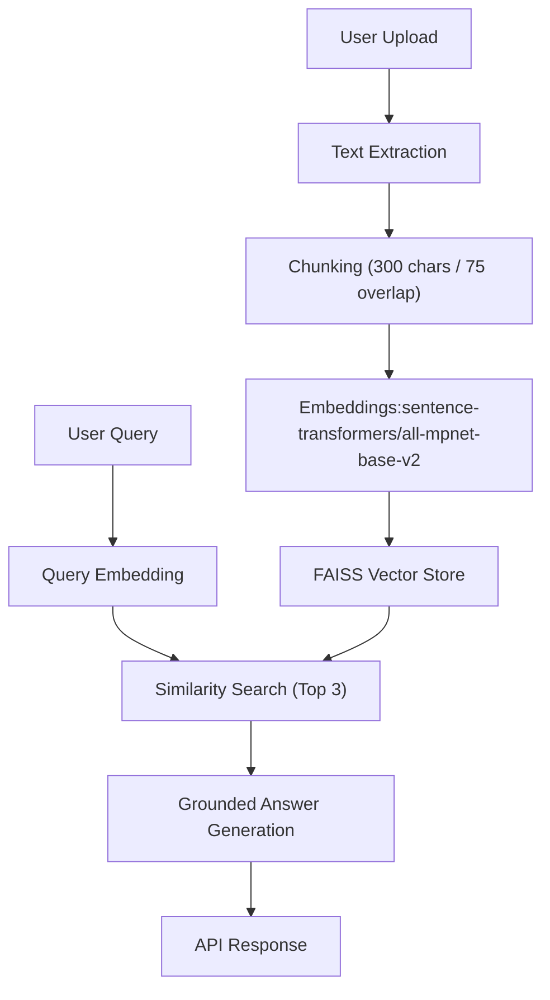

# RAG-Based Question Answering System

A modular FastAPI project that implements a Retrieval-Augmented Generation (RAG) API for PDF and TXT documents. The system stores document chunks in FAISS, retrieves the top 3 relevant chunks for each question, and generates answers grounded strictly in those retrieved chunks.

## Features

- `POST /upload` for PDF and TXT ingestion
- `POST /query` for grounded question answering
- `sentence-transformers/all-mpnet-base-v2` embeddings
- Local FAISS vector store with persisted chunk metadata
- Strict anti-hallucination fallback when no relevant information is found
- Basic in-memory rate limiting by client IP
- Pydantic request validation
- Modular project layout matching the PRD

## Project Structure

```text
app/
  api/
  services/
  models/
  utils/
data/
  raw/
  vector_store/
docs/
  explanation.md
run.py
README.md
requirements.txt
```

## Architecture



## Tech Stack

- FastAPI
- Sentence Transformers
- FAISS
- PyPDF
- OpenAI Python SDK

## Answer Generation

The project is wired to the official OpenAI SDK through environment variables:

- `OPENAI_API_KEY`
- `OPENAI_MODEL`
- `OPENAI_BASE_URL` (optional for OpenAI-compatible providers)

If you do **not** provide an API key yet, the app still works using an extractive fallback that builds answers only from the retrieved chunks. This keeps the system grounded and avoids blocking development.

## Setup

### 1. Create a virtual environment

```powershell
python -m venv .venv
.venv\Scripts\Activate.ps1
```

### 2. Install dependencies

```powershell
pip install -r requirements.txt
```

### 3. Configure environment variables

Copy `.env.example` to `.env` and fill in values when you are ready:

```env
OPENAI_API_KEY=your_api_key_here
OPENAI_MODEL=gpt-4.1-mini
OPENAI_BASE_URL=
RATE_LIMIT_MAX_REQUESTS=30
RATE_LIMIT_WINDOW_SECONDS=60
MIN_SIMILARITY_THRESHOLD=0.35
```

## Run the API

```powershell
python run.py
```

The service starts on `http://localhost:8000`.

Interactive docs are available at:

- `http://localhost:8000/docs`
- `http://localhost:8000/redoc`

## API Endpoints

### `POST /upload`

Accepts a single PDF, TXT, MD, DOC, DOCX, HTML, CSV, JSON, XML file, extracts text, chunks it, embeds it, and stores the result in FAISS.

Example response:

```json
{
  "message": "Document processed successfully",
  "chunks_created": 120
}
```

### `POST /query`

Accepts a question and returns a grounded answer plus the retrieved chunks.

Request:

```json
{
  "question": "What is the main topic of the document?"
}
```

Response:

```json
{
  "answer": "The document discusses ...",
  "retrieved_chunks": [
    "chunk1",
    "chunk2",
    "chunk3"
  ]
}
```

If there is no relevant evidence in the vector store, the system returns:

```json
{
  "answer": "No relevant information found in documents",
  "retrieved_chunks": []
}
```

## Design Notes

- **Chunk size 500 / overlap 50:** balances context retention with retrieval precision.
- **Top K = 3:** matches the PRD and keeps prompt context focused.
- **Background processing:** upload work runs in a worker thread via `asyncio.to_thread(...)`, so the FastAPI event loop stays responsive.
- **Similarity filtering:** low-confidence matches are discarded instead of forcing an answer.

More evaluation details are documented in [docs/explanation.md](/C:/Users/Shreyansh/OneDrive/Tài%20liệu/New%20project/docs/explanation.md).

## Notes for Windows

`faiss-cpu` and `sentence-transformers` depend on compiled packages. If installation is difficult on your local Windows Python version, use Python `3.11` or `3.12`, which is usually the safest path for ML tooling compatibility.
